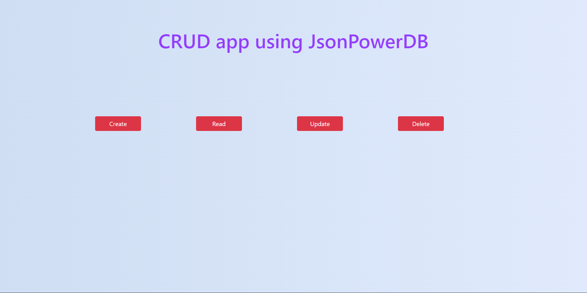
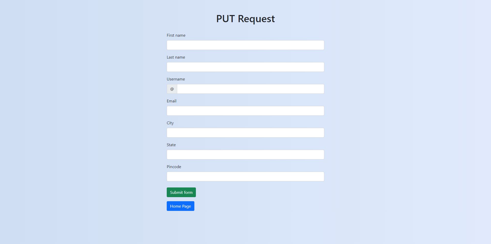
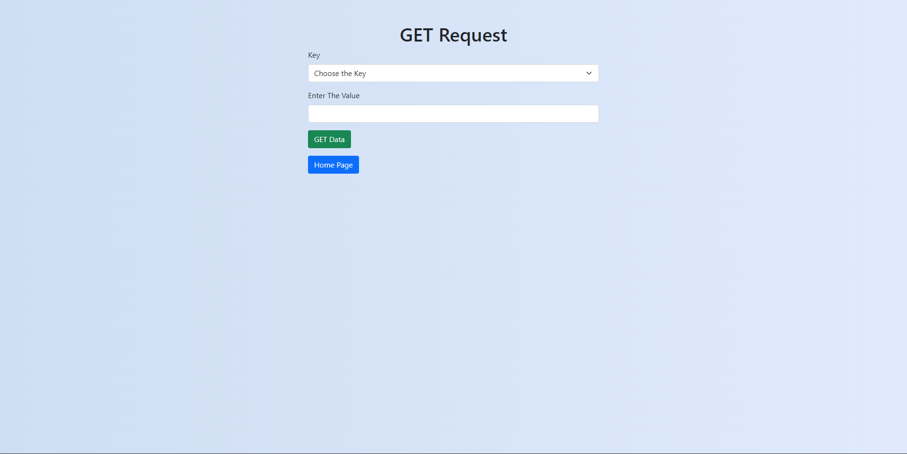
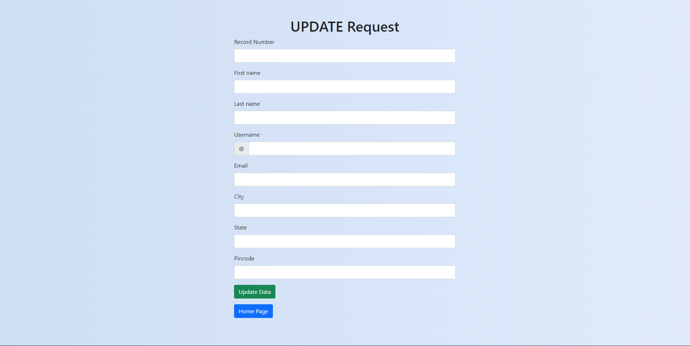
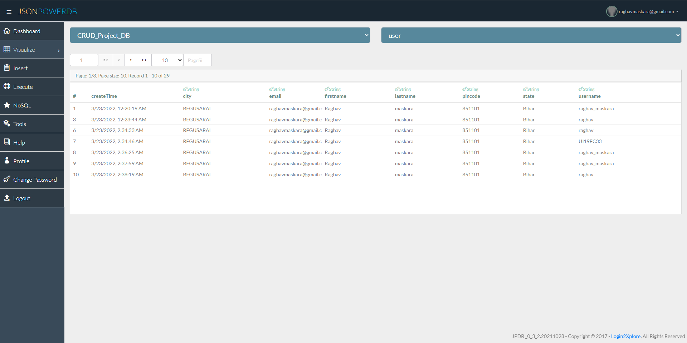

# JsonPowerDB
JsonPowerDB is the next generation Database Server with Developer friendly REST API services. <br>
It's a High Performance, Light Weight, Ajax Enabled, Serverless, Simple to Use, Real-time Database. <br>
Easy and fast to develop database applications without using any server side programming / scripting or without installing any kind of database. <br>

## Advantages of JsonPowerDB

JsonPowerDB (JPDB) is Next Generation, Creative and Disruptive Multi-mode DBMS_ with many USPs.
<li> Proprietary algorithm for High Performance CRUD operations. Multiple times faster than popular DBMS.
<li> Serverless support for faster development - A UI developer can develop complete dynamic application.
<li> DBMS with built in web / application server and embedded caching makes the performance lightning fast.
<li> Server side Native NoSQL - best query performance.
<li> In-built support to query on multiple JPDB databases.
<li> Multi-mode DBMS - Document DB, Key-Value DB, RDBMS support.
<li> Schema free - easy to develop and maintain.
<li> Web-services API - Can be used with any programming language that has support for HTTP.
<li> Enriched by a pluggable API Framework - A developer can develop a pluggable API and plugin into any of our cloud JPDB instance.
<li> Standardisation of API development framework makes the development process easy, more readable, and less error prone.
<li> Multiple security layers.
<li> Nimble, Simple to use, In Memory, Real-time DBMS.  
  
## Description
This app is built using JsonPowerDB Database where we can perform operations like Create, Read, Update and Delete. <br>
  
## HOME
 

  
## CREATE
  
We can insert single record in the database using PUT request. <br>
Http method : POST <br>
Base url : http://api.login2explore.com:5577 <br>
End-point url : /api/iml (mentioned in command when different) <br>
  
### Syntax-
```
{
    "token": <"connection-token">,
    "cmd": "PUT",
    <<"dbName": <"database-name">,>>
    <<"rel": <"relation-name">,>>
    <<"colsAutoIndex": <boolean-value>,>>
    <<"templateStr": <json-template-data>,>>
    "jsonStr": <json-data>
}
```


## READ

We can retrieve single record from the database using GET_BY_KEY method <br>
Http method : POST <br>
Base url : http://api.login2explore.com:5577 <br>
End-point url : /api/irl <br>

### Syntax-
```
  {
    "token": <"connection-token">,
    "cmd": "GET_BY_KEY",
    "dbName": <"database-name">,
    "rel": <"relation-name">,
    <<"createTime": <boolean-value>,>>
    <<"updateTime": <boolean-value>,>>
    "jsonStr": {
        <"column-name">: <"column-value">
    }
}
```


## UPDATE
  
We can Update multiple records in the database or add a new column in a record using UPDATE method <br>
Http method : POST <br>
Base url : http://api.login2explore.com:5577 <br>
End-point url : /api/iml (mentioned in command when different) <br>
  
### Syntax-
  ```
  {
    "token": <"connection-token">,
    "cmd": "UPDATE",
    <<"dbName": "database-name",>>
    <<"rel": "relation-name",>>
    "jsonStr": {
        <"record-no">: {
            <"column-name">: <"new-value">
        }
        <"record-no">: {
            <"column-name">: <"new-value">
        }
    }
}
  ```
  
  
  ## DELETE
  
  We can remove records from the database using REMOVE method <br>
  Http method : POST <br>
Base url : http://api.login2explore.com:5577 <br>
End-point url : /api/iml (mentioned in command when different) <br>
  
  ### Syntax
  ```
  {
    "token": <"connection-token">,
    "cmd": "REMOVE",
    <<"dbName": <"database-name">,>>
    <<"rel": <"relation-name">,>>
    "record": <record-number | [record-number1,...]>
}
  ```
   

  ## Database
  
